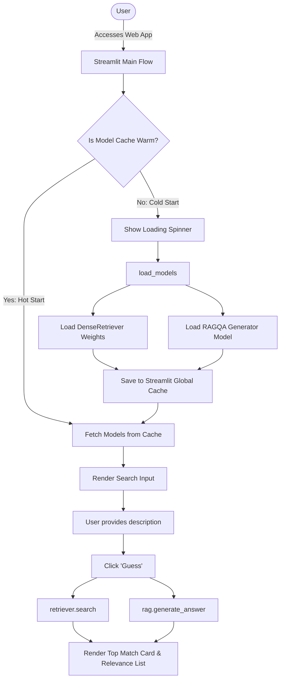

# IMDB Movie Chatbot (RAG Architecture)

This repository contains a Retrieval-Augmented Generation (RAG) chatbot designed to find movie information after giving as input a small description of it. It demonstrates the integration of dense retrieval techniques with Large Language Models (LLMs).

## 🧠 Architecture & Tech Stack

*   **Retrieval:** Dense vector representations using pre-trained transformer models.
*   **Generation:** Integration with an LLM for conversational responses.
*   **Data Processing:** Python, Pandas. Data scraped from the IMDB API.
*   **Interface:** Streamlit.

## 📁 Repository Structure

*   `data/`: Cleaned CSV datasets and serialized numpy embeddings (`.npy`).
*   `notebooks/`: Jupyter notebooks for data processing and embedding generation.
*   `src/`: Core Python modules for the chatbot logic, RAG pipeline, dense retrieval, and offline data prep.

The runtime app uses precomputed movie embeddings plus Hugging Face inference models. 

## 🔄 Optimized Model Initialization & Inference Pipeline

The Streamlit interface features an optimized model loading and inference pipeline designed for production ready performance and improved User Experience:

1. **Encapsulation & Caching:** Model weights are loaded once globally using a dedicated `load_models()` function decorated with `@st.cache_resource(show_spinner=False)`. This caches the `DenseRetriever` and `RAGQA` instances in the application's global memory.
2. **Cold Start vs. Hot Start Handling:** On the first execution (cold start), a user-friendly loading screen (`st.spinner`) displays while the models load. On all subsequent runs (hot start), the cached models are returned instantly and the spinner is bypassed entirely.
3. **Isolated Inference:** When a search is triggered, the button logic exclusively calls the `search()` and `generate_answer()` methods on the pre-loaded instances without any resource instantiation or environment variable loading overhead.

### 🗺️ System Flow Diagram



## 🔧 `src/` Folder Guide

*   `IMDB_chatbot_UI.py`: Streamlit app entrypoint. It implements the cached model loading and handles the isolated user interaction flow with a dark, cinematic UI.
*   `DenseRetriever.py`: Dense retrieval engine. It loads the clean movie CSV, loads or builds embeddings, and returns the nearest movies for a query.
*   `RAG.py`: Retrieval-Augmented Generation wrapper. It formats retrieved movie context and calls the Hugging Face text-generation model.
*   `./scripts/clean_dataset.py`: Offline cleaning script. It converts the raw TMDB export into the compact CSV used by the app.
*   `./scripts/scrap_imdb_api.py`: Offline acquisition script. It downloads popular TMDB movies and writes the raw CSV that feeds the cleaning step.

The `src/` folder is intentionally small so the production path is easy to follow. The offline scripts are kept separate from the runtime app so the UI only loads inference-time assets.

## 🚀 Local Setup

To run the chatbot locally:

```bash
# 1. Clone the repository
git clone [https://github.com/Cmanzano03/Chatbot_IMDB.git](https://github.com/Cmanzano03/Chatbot_IMDB.git)
cd Chatbot_IMDB

# 2. Create and activate a virtual environment
python3 -m venv .venv
source .venv/bin/activate

# 3. Install dependencies
pip install -r requirements.txt

# 4. Run the UI
streamlit run src/IMDB_chatbot_UI.py
```

## 📦 Dependencies

The main Python dependencies are listed in [requirements.txt](requirements.txt). Install them inside the virtual environment before running the app or notebooks.
